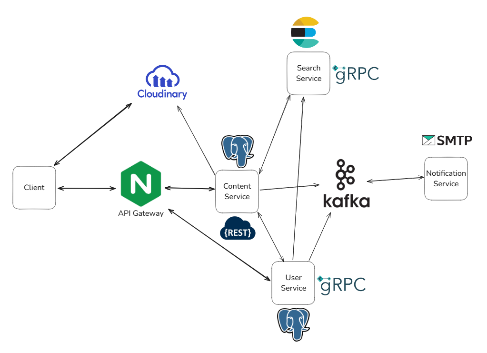

# Music-Go

Проект Music-Go - это микросервисная архитектура для музыкальной платформы, разработанная на языке Go. Система состоит из четырех основных микросервисов, каждый из которых отвечает за свой функциональный домен.

## Архитектура проекта



### Stack

Go
PostgreSQL, Elasticsearch
Kafka, gRPC, HTTP(REST)
Gin, Buf, Ffmpeg
Docker, Nginx
Cloudinary (file storage)

### Proto файлы

https://github.com/ocenb/music-protos

### User Service

Сервис аутентификации и авторизации пользователей. Управляет регистрацией, авторизацией, профилями пользователей и токенами доступа.

**Технологии:**

- PostgreSQL для хранения данных пользователей
- gRPC для коммуникации с другими сервисами
- Kafka для отправки уведомлений
- Аутентификация с использованием JWT токенов

### Content Service

Сервис для управления музыкальным контентом (треки, плейлисты, история прослушивания).

**Технологии:**

- PostgreSQL для хранения данных
- HTTP REST API на основе Gin для обработки запросов

### Search Service

Сервис для полнотекстового поиска по музыкальному контенту и пользователям.

**Технологии:**

- Elasticsearch для индексирования и поиска
- gRPC для коммуникации с другими сервисами

### Notification Service

Сервис для обработки и отправки уведомлений пользователям.

**Технологии:**

- Kafka для приема сообщений от других сервисов
- SMTP для отправки email уведомлений

## Запуск проекта

### Требования

- Docker и Docker Compose
- Go 1.24+
- Make

### Общая сеть Docker

Создайте общую сеть для микросервисов:

```bash
docker network create music-go-network
```

### Запуск сервисов

Каждый микросервис можно запустить отдельно:

1. User Service:

```bash
cd user-service
cp .env.example .env
docker-compose up -d
```

2. Content Service:

```bash
cd content-service
cp .env.example .env
docker-compose up -d
```

3. Search Service:

```bash
cd search-service
cp .env.example .env
docker-compose up -d
```

4. Notification Service:

```bash
cd notification-service
cp .env.example .env
docker-compose up -d
```

## Структура кода

Все микросервисы следуют похожей структуре проекта:

```
├── cmd/                 # Точки входа приложения
│   ├── service-name/    # Основная точка входа
│   └── migrate/         # Утилита для миграций
├── internal/            # Внутренний код приложения
│   ├── app/             # Инициализация приложения
│   ├── config/          # Конфигурация
│   ├── handlers/        # Обработчики запросов
│   ├── logger/          # Логирование
│   ├── mocks/           # Моки для unit тестов
│   ├── models/          # Модели данных
│   ├── repos/           # Репозитории для работы с БД
│   ├── services/        # Бизнес-логика
│   ├── clients/         # Клиенты для других сервисов
│   ├── storage/         # Код для работы с БД
│   └── utils/           # Утилиты
├── migrations/          # Миграции БД
├── config/              # Файлы конфигурации
├── Dockerfile           # Сборка Docker образа
├── docker-compose.yml   # Конфигурация Docker Compose
├── .env.example         # Пример переменных окружения
└── Makefile             # Команды для сборки и запуска
```

## Коммуникация между сервисами

- User Service и Search Service используют gRPC для синхронной коммуникации
- Content Service использует HTTP
- Notification Service использует Kafka
